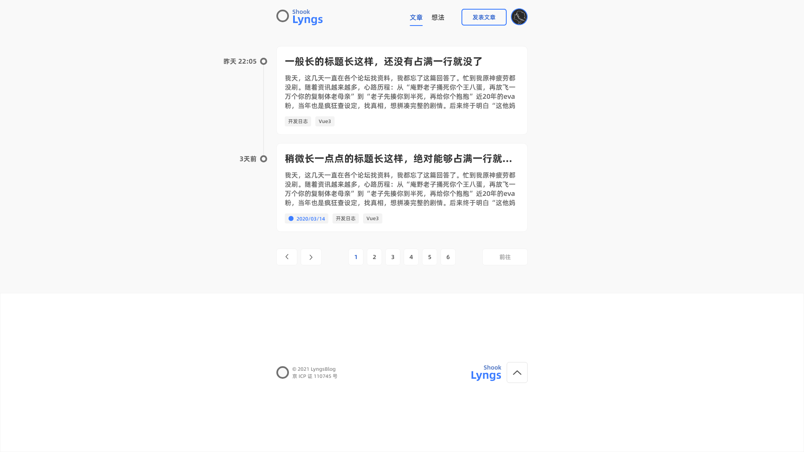
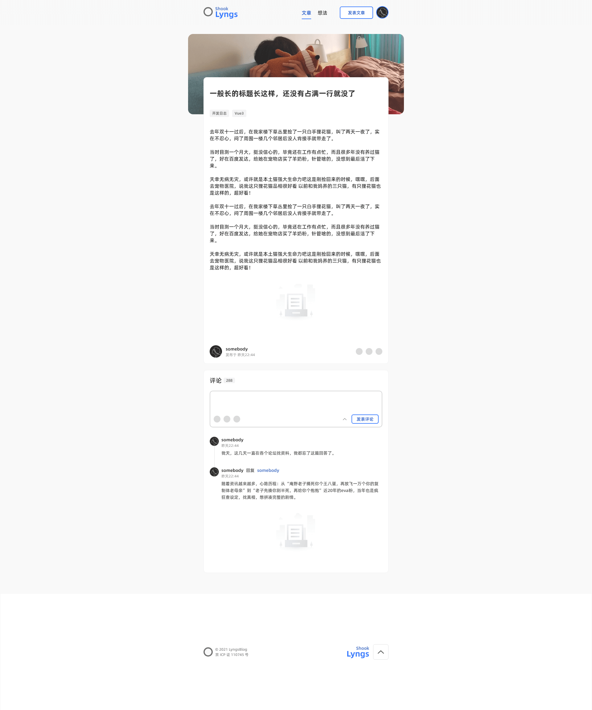

# lyngs-Blog

## This is a `Vue3+Vite2+TailwindCSS` based blog project.

The project is currently in a part-time-development stage.

It's targeting to be a `simple looked` blog website.
You can take a look at the designs of the project below.

# Designs

Articles

Article Detail

# Goals
- [x] Designs
- [ ] Articles
  - [x] ListItem
  - [x] Pager
  - [x] Locale time 
  - [ ] Fetch data
- [ ] Article detail
  - [x] Markdown to HTML
  - [x] Detail basics
  - [ ] Markdown renderer
  - [ ] Like and dislike
  - [ ] Manage article dialog
  - [ ] Donation dialog
  - [ ] Fetch data
- [ ] Post Article
  - [ ] Upload banner
  - [ ] Markdown editor
- [ ] Memos
  - [x] List item
  - [x] Reach bottom load more
  - [ ] Manage memo dialog
- [ ] Memo detail
  - [ ] Memo detail dialog
- [ ] Post Memo dialog
  - [ ] Upload images
  - [ ] Topic edit?
- [ ] Comments
  - [ ] List item
  - [ ] Reply
  - [ ] Manage Comment dialog
- [ ] Submit Comment dialog

# Bugs

- [ ] Vite
  - Vite did not pass env variable to postcss in development mode.
    This can be solved by using `cross-env` to ensure `NODE_ENV=development` in package.json -> scripts.
    Follow: https://github.com/vitejs/vite/commit/fa8574921195dd03b539c150a2ae5f97121a0aea
- [ ] Vue  
  - Component/scrollbar, mergedWrapStyle is not update normally.
    When switching mobile and PC mode in Chrome, the scrollbar margin changed in computed value, yet the actual DOM changed nothing.
    It gets fixed when other stuff updates.
